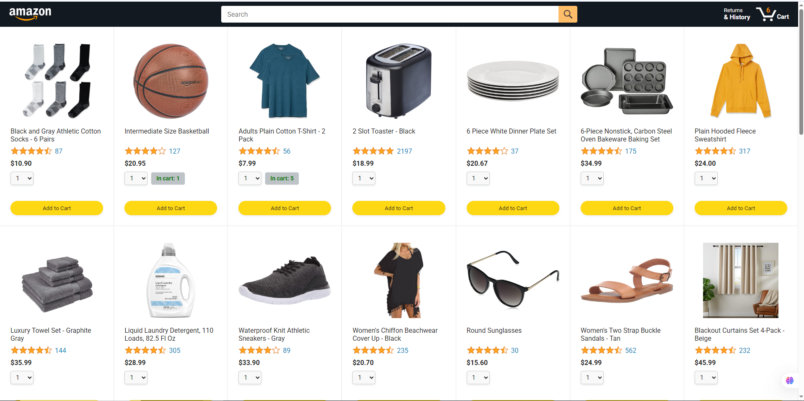
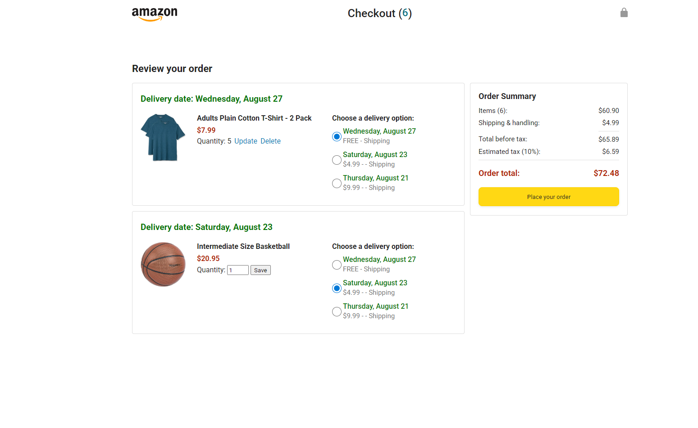

# Amazon Project – Vanilla JS E‑commerce (Responsive)

A lightweight, learning‑focused e‑commerce prototype inspired by Amazon. Built with **HTML**, **CSS**, and **Vanilla JavaScript** to deepen core JS skills (state management, DOM rendering, modular code). The app supports a realistic cart and checkout flow, dynamic shipping options, and a responsive UI.

---

## 🔗 Live Demo

- 🌐 **Live Demo:** [] ()

> Tip: You can deploy easily to **Netlify**, **Vercel**, or **GitHub Pages**. See the [Deployment](#-deployment) section.

---

## 📸 Screenshots

> Place PNG/JPG files in a `/screenshots` folder, then update the image paths below.

* **Home page** 

* **Order Summary & payment Summary** 


---

## ✨ Features

* **Add to Cart** with quantity selector; shows **inline “added” green badge** on add.
* **Cart Counter** visible on product card/button (see immediate feedback of items added).
* **Order Summary** page:

  * View all added products with quantities.
  * **Update** quantity or **Delete** items from cart.
* **Shipping Options** (per product):

  * **7‑day** delivery: **Free** shipping.
  * **4‑day** delivery: **\$4.99**.
  * **1‑day** delivery: **\$9.99**.
  * Selecting a shipping tier updates totals **immediately**.
* **Payment Summary** with live calculations:

  * Subtotal (sum of quantities × price)
  * Shipping (based on selected option)
  * **10% tax** added
  * **Grand Total**
* **Responsive Layout** for mobile, tablet, and desktop.

---

## 🧠 Why This Project

The goal is to strengthen **Vanilla JS fundamentals**—no frameworks—by implementing realistic e‑commerce flows (state, rendering, modular utilities, and instant UI feedback). The codebase favors clarity and small, testable functions.

---

## 💻 Tech Stack

* **HTML5**, **CSS3** (responsive, utility classes where helpful)
* **Vanilla JavaScript (ES Modules)**
* Optional utility: **dayjs** (date formatting)

---

## 🚀 Getting Started (Local)

### 1 Clone the repo

```bash
git clone https://github.com/ziaul-hoque4820/Amazon-E-commerce.git
cd Amazon-E-commerce
```

### 2 Open in a local server

Any static server works. Options:

* **VS Code Live Server** extension → Right‑click `index.html` → **Open with Live Server**
* **Node http-server** (install once):

  ```bash
  npm install -g http-server
  http-server -p 5173
  ```

  Then open: `http://localhost:5173`
* **Python** (if installed):

  ```bash
  # Python 3
  python -m http.server 5173
  ```

### 3 Usage

* Browse products, click **Add to Cart** (adjust quantity before adding if needed).
* See the **green “added” badge** and updated cart counter.
* Go to **Order Summary** to edit quantities or delete items.
* Choose shipping speed per product; totals update instantly.
* Review **Payment Summary**: subtotal + shipping + 10% tax → total.

---

## 🧩 Key Modules (Example)

* `data/products.js` – product catalog
* `data/cart.js` – cart state (add, update, remove)
* `data/deliveryOptions.js` – shipping tiers and prices
* `utils/money.js` – currency formatting
* `pages/orderSummary.js` – render order summary & payment calculations

> Names are illustrative; match to your repository.

---

## ✅ Roadmap

* [ ] **Search bar** to filter products by name/category
* [ ] **Order history by date** (view how many products ordered on a given day)
* [ ] **Order tracking status** (Preparing → Shipping → Delivered)
* [ ] Persistent storage (localStorage or API)
* [ ] Basic tests for cart & totals

---

## 🧪 Testing (Optional)

If you add tests later:

```bash
# example if using vitest/jest in future
npm install --save-dev vitest
npx vitest
```

---

## 📦 Deployment

### GitHub Pages

1. Put all assets relative to `index.html`.
2. Enable **Pages** in repository settings → Deploy from `main` branch `/root` (or `/docs`).

### Netlify

* Drag‑and‑drop the folder, or connect repo. Build command: *None*. Publish directory: `/`.

### Vercel

* Import the repo. Framework preset: **Other** (static). Output directory: `/`.

Update the **Live Demo** link at the top after deploying.

---

## 🗂️ Environment & Config

This is a static project; no server env vars required. If you later add APIs, document the required keys here.

---

## 🤝 Contributing

Contributions are welcome! Please:

1. Fork the repo
2. Create a feature branch: `git checkout -b feat/your-feature`
3. Commit changes: `git commit -m "Add your feature"`
4. Push branch: `git push origin feat/your-feature`
5. Open a Pull Request

---

## 🙌 Acknowledgements

* Inspired by Amazon’s UX for learning purposes
* Thanks to open‑source icons/tools used in the UI

---

## 🇧🇩 Note (Bangla)

এই প্রকল্পটি মূলত **Vanilla JavaScript শিখতে ও বুঝতে** বানানো। ভবিষ্যতে সার্চ, অর্ডার হিস্টরি ও ট্র্যাকিং যুক্ত হবে। উপরের নির্দেশনা মেনে লোকাল মেশিনে রান করতে পারবেন এবং ডেপ্লয় করে **Live Demo** লিংক আপডেট করে দিন।
